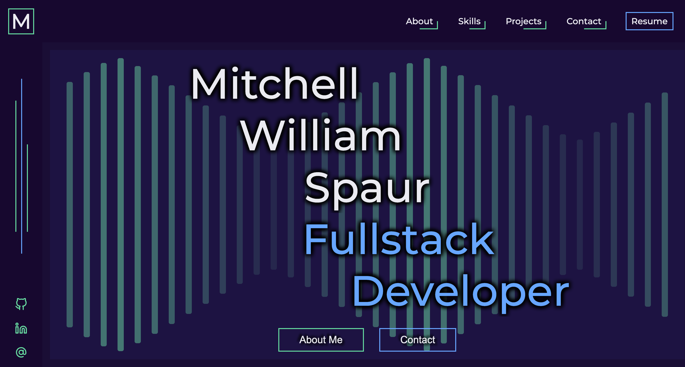

# My Portfolio

Click the image if you wish to visit my portfolio.

---

A refined portfolio with my personal favorite styling cues, incorporating technology such as Typescript and Styled-Components which I've grown to love.

## Technology

- NextJS (React)
- Typescript
- Styled-Components
- React-Intersection-Observer

### Features

- NextJS has amazing scalability with it's intergrating routing and combined API handling which will allow my portfolio to expand and evolve.
- Styled-Components offers the ability for diverse theming and great flexibility in usable styled components across the entire app.

### Challenges Faced

- NextJS offeres amazing features, but comes with some opinionated code patterns which made it a challenge to intergrate Styled-Components due to NextJS's static-site generation. With some additions to NextJS's '\_document' file, it will load styled-components properly.
